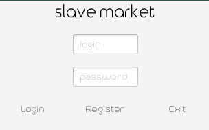
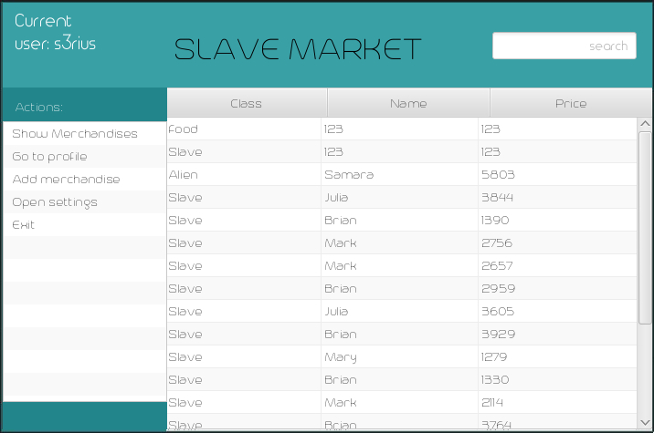
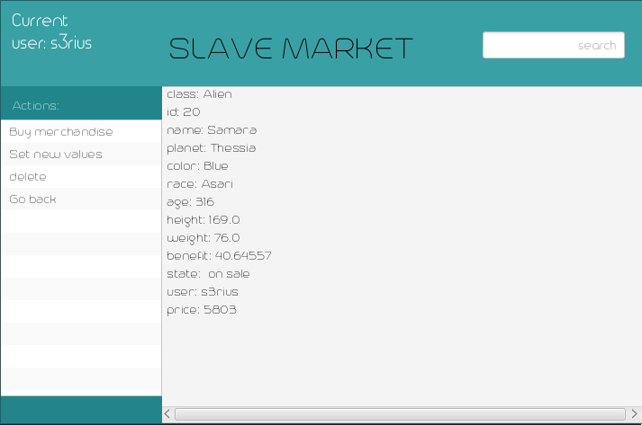

<h1 align="center">
  
</h1>

<h3 align="center">Simple online shopping app of abstract merchandise</h3>

  <a href="https://github.com/s3rius/SlaveMarket/wiki">Wiki</a> •
  <a href="#screenshots">Screenshots</a> •
  <a href="#features">Features</a> •
  <a href="#download">Download</a> •
  <a href="#credits">Credits</a>

# Screenshots
At the start of client app you'll see login/register form.

<h4 align="center">
  
   
  Login screen
</h4>

After successful login your app will show you main screen, that contains table of available merchandise.

<h4 align="center">
  
   
  Available merchandises
</h4>

If you choose and click twice on merchandise you will be redirected to merchandise details menu. Where you can buy or setup chosen merchandise

<h4 align="center">
  
   
   Merchandise details
</h4>

That app contains not only these screens.But for demo that's all.

# Features
  
# Download
 To download last version of program please vist [build guide](https://github.com/s3rius/SlaveMarket/wiki#build)
 in wiki
# Credits
Author [Paul Kirilin](https://github.com/s3rius)
